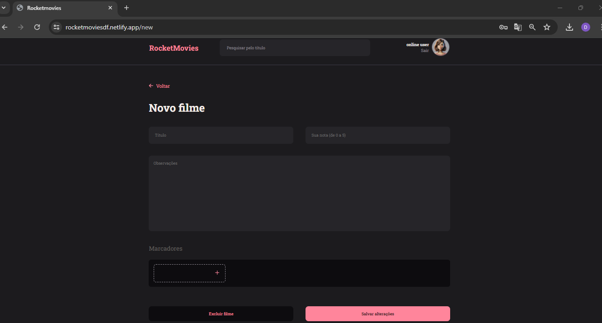
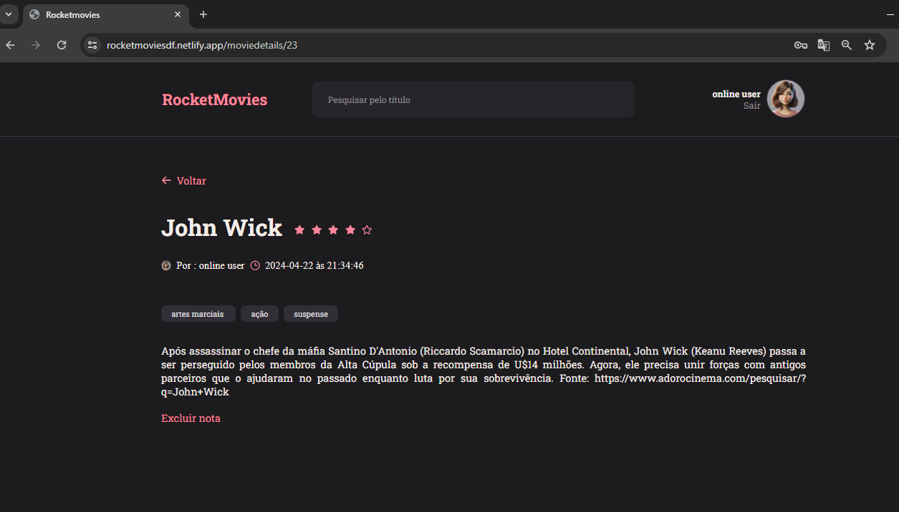
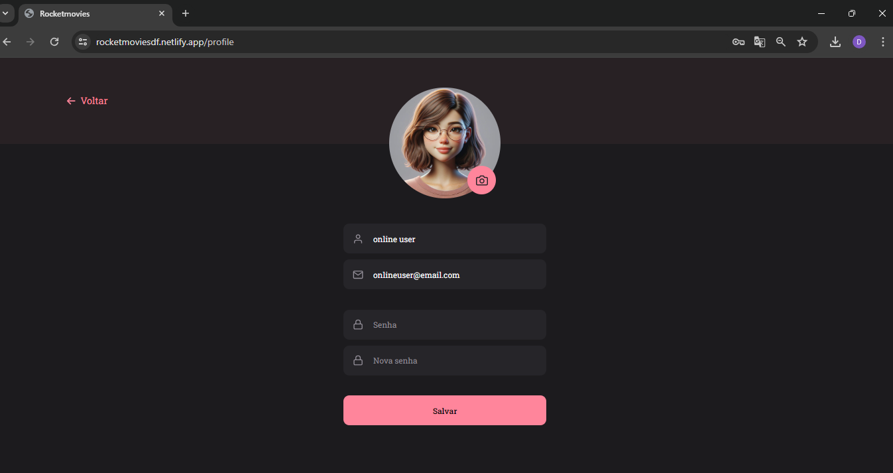

# Integração do Frontend e Backend da aplicação RocketMovies

### Essa tarefa faz parte do curso Explorer da [Rocketseat](https://www.rocketseat.com.br).

Nessa atividade foi realizada a integração do front-end com o Backend;

## 🛠 Backend

Repositório do Backend está disponível em:

https://github.com/dayanezaira/rocketmovies_api

## 🔖 Deploy

Aplicação Rocketmovies publicada no Netlify: https://rocketmoviesdf.netlify.app/

